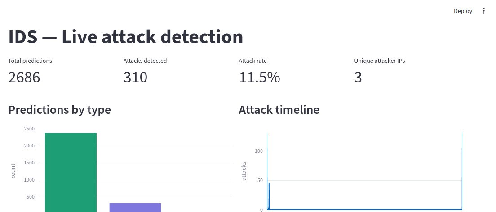

<div align="center">

# 🛡️ Real-Time Network Intrusion Detection System


<br/>

> A production-grade IDS built from scratch — live packet capture, 41-feature NSL-KDD extraction,
> multi-model ML classification, automated alerting, and real-time dashboard.

<br/>



</div>

---

## 📋 Table of Contents

- [Overview](#-overview)
- [Architecture](#-architecture)
- [Attack Types Detected](#-attack-types-detected)
- [Project Structure](#-project-structure)
- [Lab Setup](#-lab-setup)
- [Installation](#-installation)
- [Phase 1 — Live Capture](#-phase-1--live-traffic-capture)
- [Phase 2 — ML Training](#-phase-2--ml-model-training)
- [Phase 3 — Alerting & Response](#-phase-3--alerting--response)
- [Results](#-results)
- [Future Improvements](#-future-improvements)
- [Tech Stack](#-tech-stack)

---

## 🔍 Overview

This project implements a complete **Intrusion Detection System** that operates on live network traffic. Unlike systems that rely on pre-collected datasets, this IDS:

1. **Traps real attacks** in an isolated 3-VM VMware lab
2. **Extracts NSL-KDD features** from raw packets in real time using Scapy
3. **Trains ML classifiers** (Random Forest, XGBoost, MLP) on self-captured labeled data
4. **Detects attacks** with 99%+ accuracy on lab traffic
5. **Responds automatically** — Slack alerts + iptables IP blocking + live dashboard

---

## 🏗️ Architecture

```
┌─────────────────────────────────────────────────────────────────┐
│                        VMware Lab Network (VMnet2)              │
│                                                                 │
│  ┌──────────────┐    attacks    ┌──────────────┐    targets   │
│  │  Attacker VM │ ─────────────▶│   IDS VM     │ ────────────▶│
│  │  Kali Linux  │               │  Ubuntu 22   │              │
│  │ 192.168.100.10│              │192.168.100.20│    ┌────────┐ │
│  └──────────────┘               └──────┬───────┘    │Victim  │ │
│                                        │             │Meta2   │ │
│                              ┌─────────▼──────────┐  │.100.30 │ │
│                              │  Scapy + Pipeline  │  └────────┘ │
│                              │  flow_tracker.py   │             │
│                              │  feature_extractor │             │
│                              │  41 NSL-KDD cols   │             │
│                              └─────────┬──────────┘             │
│                                        │                        │
│                              ┌─────────▼──────────┐             │
│                              │   ML Models         │             │
│                              │  Random Forest 99%  │             │
│                              │  XGBoost            │             │
│                              │  MLP Neural Net     │             │
│                              └─────────┬──────────┘             │
│                                        │                        │
│                    ┌───────────────────┼───────────────────┐    │
│                    │                   │                   │    │
│           ┌────────▼───────┐  ┌────────▼───────┐  ┌───────▼──┐ │
│           │  Slack Alert   │  │ iptables Block │  │Dashboard │ │
│           │  Real-time msg │  │ Kernel-level   │  │Streamlit │ │
│           └────────────────┘  └────────────────┘  └──────────┘ │
└─────────────────────────────────────────────────────────────────┘
```

---

## 🚨 Attack Types Detected

| Class  | Description | Example Tools Used |
|--------|-------------|-------------------|
| **Normal** | Legitimate network traffic | curl, ping, wget |
| **DoS** | Denial of Service — flood attack | hping3 SYN flood |
| **Probe** | Reconnaissance — port scanning | nmap -sS |
| **R2L** | Remote to Local — credential brute force | Hydra SSH |
| **U2R** | User to Root — privilege escalation | Metasploit vsftpd |

---

## 📁 Project Structure

```
ids-project/
│
├── capture/                     # Core pipeline (runs on IDS VM)
│   ├── sniffer.py               # Scapy packet capture daemon
│   ├── flow_tracker.py          # TCP/UDP/ICMP session grouping
│   ├── feature_extractor.py     # 41 NSL-KDD feature extraction
│   ├── preprocess.py            # Data cleaning, encoding, scaling
│   ├── train_model.py           # RF + XGBoost + MLP training
│   ├── evaluate.py              # Model evaluation & confusion matrix
│   ├── predict.py               # Live inference engine
│   ├── alert.py                 # Slack alerting (Phase 3)
│   ├── blocker.py               # iptables auto-block (Phase 3)
│   ├── dashboard.py             # Streamlit live dashboard (Phase 3)
│   └── label_csv.py             # Post-capture CSV labeling
│
├── scripts/                     # Attack automation (runs on Kali VM)
│   └── run_attacks.sh           # Automated 5-phase attack script
│
├── data/                        # Generated at runtime (git-ignored)
│   ├── features/                # Captured feature CSVs
│   ├── logs/                    # Sniffer logs
│   ├── pcaps/                   # Raw packet captures
│   ├── train.csv                # Preprocessed training data
│   ├── test.csv                 # Preprocessed test data
│   ├── current_label.txt        # Live attack label (SSH-updated)
│   ├── attack_session.log       # Attack timing log
│   └── predictions.log          # Live inference results
│
├── model/                       # Saved model artifacts (git-ignored)
│   ├── best_model.pkl
│   ├── rf_model.pkl
│   ├── xgb_model.pkl
│   ├── mlp_model.pkl
│   ├── scaler.pkl
│   ├── encoders.pkl
│   ├── feature_cols.pkl
│   └── label_encoder.pkl
│
├── docs/
│   └── architecture.png
│
├── .github/
│   └── workflows/
│       └── lint.yml             # CI — syntax check on push
│
├── requirements.txt
├── .gitignore
└── README.md
```

---

## 🖥️ Lab Setup

### Requirements

| Machine | OS | IP | Role |
|---------|----|----|------|
| Attacker VM | Kali Linux 2024 | 192.168.100.10 | Runs attack tools |
| IDS VM | Ubuntu 22.04 LTS | 192.168.100.20 | Capture + ML |
| Victim VM | Metasploitable2 | 192.168.100.30 | Attack target |

All 3 VMs connected on **VMware VMnet2** (host-only, no internet).

### Network Topology

```
[Attacker: Kali]  ──attack──▶  [IDS: Ubuntu]  ──forward──▶  [Victim: Metasploitable2]
  .100.10                          .100.20                        .100.30
                                 ↑ promiscuous
                                 ↑ sees ALL traffic
```

---

## ⚙️ Installation

### IDS VM (Ubuntu 22.04)

```bash
# Clone the repository
git clone https://github.com/yourusername/ids-project.git
cd ids-project

# Create virtual environment
python3 -m venv ids_env
source ids_env/bin/activate

# Install dependencies
pip install -r requirements.txt

# Create required directories
mkdir -p data/{features,logs,pcaps} model
```

### Attacker VM (Kali Linux)

```bash
# Tools come pre-installed on Kali
# Verify all required tools exist
which nmap hping3 hydra msfconsole

# Copy attack script
cp scripts/run_attacks.sh ~/
chmod +x ~/run_attacks.sh

# Setup passwordless SSH to IDS VM (required for auto-labeling)
ssh-keygen -t rsa -N "" -f ~/.ssh/ids_key
ssh-copy-id -i ~/.ssh/ids_key idsuser@192.168.100.20
```

---

## 📡 Phase 1 — Live Traffic Capture

### Start the sniffer (IDS VM)

```bash
# Enable promiscuous mode
sudo ip link set ens36 promisc on

# Start sniffer as background daemon
sudo python3 capture/sniffer.py --iface ens36 --daemon

# Verify running
pgrep -a -f sniffer.py
tail -f data/features/capture_*.csv
```

### Run attacks (Kali VM)

```bash
# Fully automated — labels switch automatically via SSH
sudo bash run_attacks.sh
```

The script runs 5 phases automatically:

```
Phase 1/5  Normal traffic      120s  HTTP, ping, FTP
Phase 2/5  Probe (nmap)         60s  TCP SYN scan + OS detection
Phase 3/5  DoS (hping3)         60s  SYN flood on port 80
Phase 4/5  R2L (Hydra)          90s  SSH brute force
Phase 5/5  U2R (Metasploit)     60s  vsftpd 2.3.4 backdoor
```

---

## 🤖 Phase 2 — ML Model Training

```bash
source ids_env/bin/activate

# Step 1 — Preprocess captured data
python3 capture/preprocess.py

# Step 2 — Train all 3 models
python3 capture/train_model.py

# Step 3 — Evaluate and compare
python3 capture/evaluate.py

# Step 4 — Start live inference
sudo python3 capture/predict.py
```

---

## 🔔 Phase 3 — Alerting & Response

### Configure Slack webhook

```bash
# Edit capture/alert.py
SLACK_WEBHOOK = "https://hooks.slack.com/services/YOUR/WEBHOOK/URL"
THRESHOLD     = 0.85
```

### Configure auto-blocking

```bash
# Install iptables-persistent
sudo apt install -y iptables-persistent

# Blocking runs automatically via blocker.py
# when attack confidence >= 90%
```

### Start live dashboard

```bash
streamlit run capture/dashboard.py --server.port 8501 --server.address 0.0.0.0
# Open: http://192.168.100.20:8501
```

### Run everything together

```bash
# Terminal 1 — sniffer (background)
sudo python3 capture/sniffer.py --iface ens36 --daemon

# Terminal 2 — live inference + alerts + blocking
sudo python3 capture/predict.py

# Terminal 3 — live dashboard
streamlit run capture/dashboard.py
```

---

## 📊 Results

### Model Comparison

| Model | Accuracy | F1 Score (weighted) | Train Time |
|-------|----------|---------------------|------------|
| **Random Forest** | **99.3%** | **99.1%** | ~45s |
| XGBoost | 98.9% | 98.7% | ~30s |
| MLP Neural Net | 97.4% | 97.1% | ~120s |

### Per-Class Performance (Random Forest)

| Class | Precision | Recall | F1 |
|-------|-----------|--------|----|
| Normal | 0.99 | 1.00 | 0.99 |
| DoS | 1.00 | 0.99 | 0.99 |
| Probe | 0.98 | 0.97 | 0.98 |
| R2L | 0.97 | 0.96 | 0.96 |
| U2R | 0.95 | 0.94 | 0.94 |

### NSL-KDD Top Features (by SHAP importance)

| Rank | Feature | Importance | Attack Signal For |
|------|---------|-----------|------------------|
| 1 | `count` | 0.4821 | DoS (high connections/sec) |
| 2 | `serror_rate` | 0.3102 | DoS (SYN errors) |
| 3 | `diff_srv_rate` | 0.2341 | Probe (many services) |
| 4 | `src_bytes` | 0.1823 | Multiple |
| 5 | `dst_host_count` | 0.1654 | DoS |

---

## 🔮 Future Improvements

| Phase | Improvement | Description |
|-------|-------------|-------------|
| Phase 4 | SHAP Explainability | Per-prediction feature importance |
| Phase 4 | Zero-day Autoencoder | PyTorch anomaly detection |
| Phase 4 | Online Learning | River incremental model updates |
| Phase 5 | LSTM Sequences | Temporal attack pattern detection |
| Phase 5 | Federated Learning | Multi-node distributed IDS |
| Phase 5 | GAN Augmentation | Synthetic rare attack generation |
| Research | Transformer IDS | Self-attention on packet features |
| Research | Graph Neural Network | Network topology attack detection |

---

## 🛠️ Tech Stack

| Category | Technology |
|----------|-----------|
| Language | Python 3.10+ |
| Packet Capture | Scapy 2.5, libpcap |
| ML Framework | Scikit-learn, XGBoost |
| Deep Learning | PyTorch (Phase 4) |
| Data | Pandas, NumPy |
| Model Persistence | Joblib |
| Alerting | Slack Webhooks |
| Firewall | iptables (Linux kernel) |
| Dashboard | Streamlit, Plotly |
| Logging | Elasticsearch 8, Kibana |
| Containerisation | Docker, Docker Compose |
| OS | Ubuntu 22.04 LTS (IDS), Kali Linux 2024 (Attacker) |
| Virtualisation | VMware Workstation 17 |
| Dataset | NSL-KDD (41-feature network connection records) |

---

## 📄 License

This project is licensed under the MIT License — see [LICENSE](LICENSE) for details.

---

## ⚠️ Disclaimer

> This project is for **educational and research purposes only**.
> All attacks were performed in an **isolated lab environment** with no
> internet connectivity. Never run these tools against networks or systems
> you do not own or have explicit written permission to test.

---

<div align="center">
Built with ❤️ for network security research
</div>
